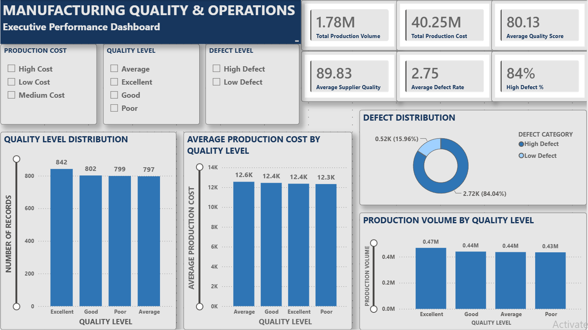
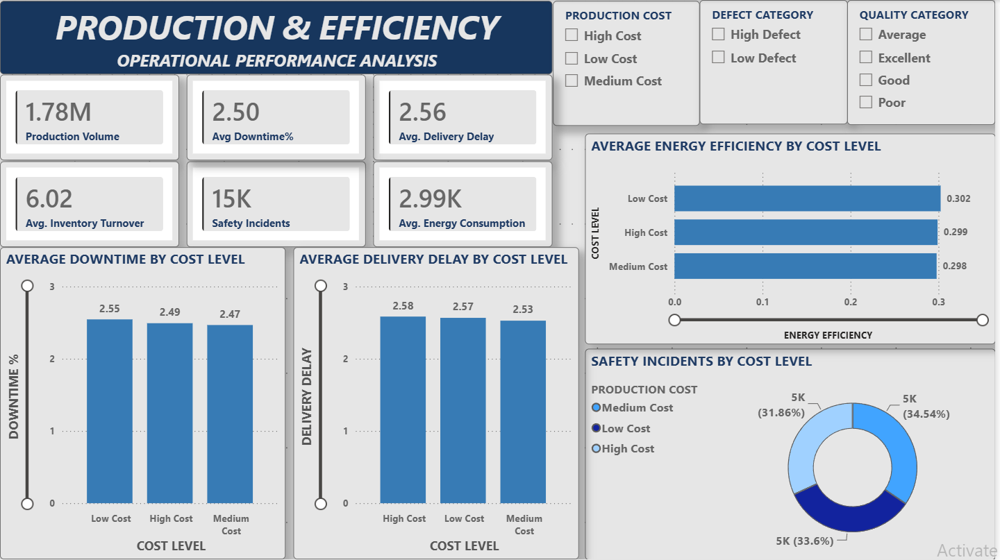

# Manufacturing Quality & Operations Analytics Dashboard

A Power BI dashboard analyzing quality, defects, production cost, and operational efficiency across a manufacturing production dataset. The project is designed to identify defect patterns and understand how production cost, supplier quality, and plant operations relate to production outcomes.

---

## 📊 Overview

The dashboard is built on a single production dataset (`manufacturing_defect_dataset.csv`) containing **3,240 production records**, with metrics covering production, cost, quality, delivery, safety, inventory, maintenance, and energy performance.

The project addresses key business questions such as:

- What share of production runs are classified as "High Defect"?
- How does production cost category (Low / Medium / High) relate to quality and operational performance?
- How do downtime, delivery delays, safety incidents, and energy efficiency vary across cost categories?
- How are production volume and production cost distributed across quality tiers?
- How do supplier quality and overall quality relate to manufacturing outcomes?

---

## 🎯 Business Objectives

The primary objectives of this project are to:

1. Monitor overall manufacturing production performance.
2. Analyze production costs across different cost categories.
3. Evaluate product and supplier quality.
4. Identify defect distribution and defect-related patterns.
5. Analyze downtime and delivery delays.
6. Monitor inventory and operational efficiency.
7. Track safety incidents.
8. Analyze energy consumption and energy efficiency.
9. Compare operational performance across production cost categories.
10. Present manufacturing data through an interactive and easy-to-understand dashboard.

---

## 📑 Report Pages

The Power BI report contains two analytical pages.

### 1. Executive Performance Dashboard

Provides a high-level overview of manufacturing quality and production performance.

#### KPI Cards

- Total Production Volume
- Total Production Cost
- Average Production Cost
- Average Quality Score
- Average Supplier Quality
- Average Defect Rate

#### Visual Analysis

- Quality Level Distribution
- Defect Distribution
- Average Production Cost by Quality Level
- Production Volume by Quality Level

#### Interactive Filters

- Production Cost
- Quality Level
- Defect Level

---

### 2. Production & Efficiency Dashboard

Provides a detailed view of manufacturing operational efficiency.

#### KPI Cards

- Production Volume
- Average Downtime %
- Average Delivery Delay
- Average Inventory Turnover
- Safety Incidents
- Average Energy Consumption

#### Visual Analysis

- Average Downtime by Cost Level
- Safety Incidents by Cost Level
- Average Delivery Delay by Cost Level
- Average Energy Efficiency by Cost Level

#### Interactive Filters

- Production Cost
- Defect Category
- Quality Category

---

## 🗂️ Data Model

The report uses a single fact table:

**`ManufacturingData` — 3,240 rows, 19 columns**

The data is loaded from a CSV source and prepared using Power Query.

| Column | Type | Description |
|---|---|---|
| ProductionVolume | Integer | Units produced in the production run |
| ProductionCost | Decimal | Total cost of the production run |
| ProductionCostCategory | Text | Derived: Low / Medium / High Cost |
| SupplierQuality | Decimal | Supplier quality score |
| DeliveryDelay | Integer | Delivery delay in days |
| DefectRate | Decimal | Defect rate for the production run |
| QualityScore | Decimal | Overall quality score |
| QualityCategory | Text | Derived: Poor / Average / Good / Excellent |
| MaintenanceHours | Integer | Maintenance hours logged |
| DowntimePercentage | Decimal | Percentage of downtime |
| InventoryTurnover | Decimal | Inventory turnover ratio |
| StockoutRate | Decimal | Stockout rate |
| WorkerProductivity | Decimal | Worker productivity score |
| SafetyIncidents | Integer | Safety incidents recorded |
| EnergyConsumption | Decimal | Energy consumed |
| EnergyEfficiency | Decimal | Energy efficiency ratio |
| AdditiveProcessTime | Decimal | Additive manufacturing process time |
| AdditiveMaterialCost | Decimal | Additive manufacturing material cost |
| DefectStatus | Integer (0/1) | 1 = defective run |
| DefectCategory | Text | Derived: High Defect / Low Defect |

---

## 🔄 Power Query / ETL Logic

The source data is loaded from CSV, data types are assigned, and analytical categories are created using conditional logic in Power Query.

### Defect Category

```text
if [DefectStatus] = 0 then "Low Defect" else "High Defect"
```

### Production Cost Category

```text
if [ProductionCost] < 10000 then "Low Cost"
else if [ProductionCost] < 15000 then "Medium Cost"
else "High Cost"
```

### Quality Category

```text
if [QualityScore] < 70 then "Poor"
else if [QualityScore] < 80 then "Average"
else if [QualityScore] < 90 then "Good"
else "Excellent"
```

These derived categories are used throughout the dashboard to support segmentation and comparative analysis.

---

## 📐 DAX Measures

All measures are created on the `ManufacturingData` table.

### Total Production Volume

```DAX
Total Production Volume =
SUM(ManufacturingData[ProductionVolume])
```

Calculates the total number of units produced across all production records.

### Total Production Cost

```DAX
Total Production Cost =
SUM(ManufacturingData[ProductionCost])
```

Calculates the total production cost across all production records.

### Average Production Cost

```DAX
Average Production Cost =
AVERAGE(ManufacturingData[ProductionCost])
```

Calculates the average production cost per production record.

### Average Quality Score

```DAX
Average Quality Score =
AVERAGE(ManufacturingData[QualityScore])
```

Calculates the average quality score across production records.

### Average Supplier Quality

```DAX
Average Supplier Quality =
AVERAGE(ManufacturingData[SupplierQuality])
```

Calculates the average supplier quality score.

### Average Defect Rate

```DAX
Average Defect Rate =
AVERAGE(ManufacturingData[DefectRate])
```

Calculates the average defect rate across production records.

### Total Records

```DAX
Total Records =
COUNTROWS(ManufacturingData)
```

Calculates the total number of production records.

### High Defect Count

```DAX
High Defect Count =
CALCULATE(
    COUNTROWS(ManufacturingData),
    ManufacturingData[DefectCategory] = "High Defect"
)
```

Counts production records classified as **High Defect**.

### High Defect %

```DAX
High Defect % =
DIVIDE(
    [High Defect Count],
    [Total Records],
    0
)
```

Calculates the proportion of production records classified as High Defect.

`DIVIDE()` is used instead of direct division to safely handle cases where the total record count is zero.

---

## 💡 Key Findings

The current dashboard provides the following high-level observations:

- Total production volume is approximately **1.78M units**.
- Total production cost is approximately **40.25M**.
- Average quality score is approximately **80.13**.
- Average supplier quality is approximately **89.83**.
- Average defect rate is approximately **2.75%**.
- Approximately **84% of production runs are classified as "High Defect" based on the `DefectStatus` field**.
- Production cost varies across the defined Low, Medium, and High Cost categories.
- Quality performance can be compared across Poor, Average, Good, and Excellent quality categories.
- Downtime and delivery delays can be compared across production cost categories.
- Energy efficiency and safety incidents can be analyzed across different cost categories.
- Interactive filters allow users to investigate relationships between cost, quality, defects, and operational performance.

> The figures above are based on the current dataset and dashboard configuration. Values should be re-verified against the refreshed PBIX report if the underlying data changes.

---

## 🖼️ Dashboard Preview

### Executive Performance Dashboard



### Production & Efficiency Dashboard



---

## 🛠️ Tools & Technologies

- **Microsoft Power BI Desktop** — dashboard development, data modeling, and report design
- **Power Query (M)** — data preparation and feature engineering
- **DAX** — KPI calculations and analytical measures
- **Data Visualization** — interactive charts, KPI cards, and slicers

---

## 📁 Project Structure

```text
manufacturing-quality-operations-powerbi/
│
├── screenshots/
│   ├── executive-performance-dashboard.png
│   └── production-efficiency-dashboard.png
│
├── Manufacturing_Quality_Operations_Analytics.pbix
│
└── README.md
```

---

## 🚀 How to Use

1. Download the `Manufacturing_Quality_Operations_Analytics.pbix` file from this repository.
2. Open the file using **Microsoft Power BI Desktop**.
3. Navigate between the two report pages.
4. Use the available slicers to filter the analysis.
5. Explore the KPI cards and visualizations.
6. Analyze production, quality, cost, and operational efficiency.

> **Note:** Microsoft Power BI Desktop is required to open and interact with the `.pbix` file.

---

## 🎓 Skills Demonstrated

- Power BI Dashboard Development
- Power Query
- DAX
- Data Modeling
- KPI Development
- Data Visualization
- Business Intelligence
- Manufacturing Analytics
- Interactive Reporting
- Business-Oriented Data Analysis
- Dashboard Design
- Data Storytelling

---

## 👨‍💻 About

Built as a portfolio project to demonstrate practical skills in Power BI data preparation, data modeling, DAX measure development, KPI analysis, and interactive dashboard design for a manufacturing quality and operations use case.

**Author:** Kshitiz Saxena

**GitHub:** [github.com/Kshitiz0808](https://github.com/Kshitiz0808)
